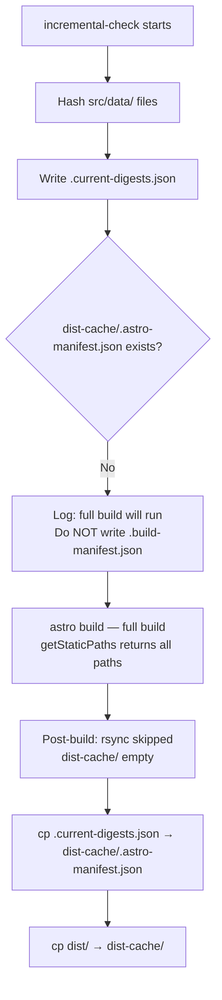
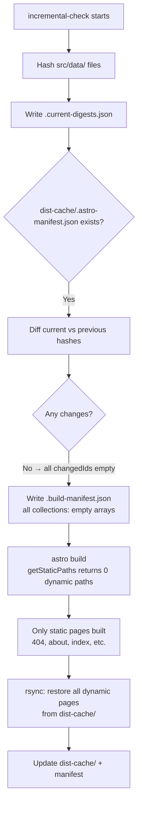
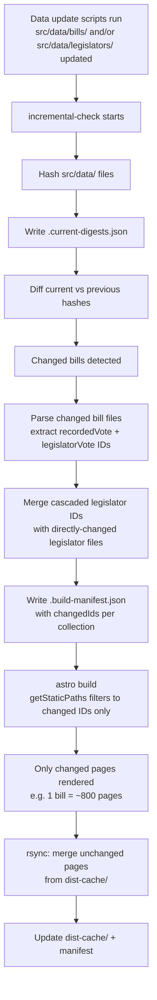
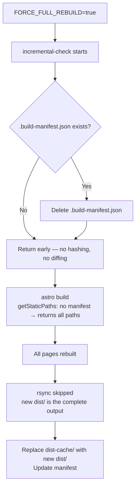

# Incremental Build System

The site can generate hundreds of thousands of static pages. Rebuilding all of
them on every data update is slow and unnecessary — most pages don't change
between runs. This document explains how the incremental build system works,
when each scenario occurs, and what files are involved.

---

## The Problem

Astro's static output mode (`output: 'static'`) runs every `getStaticPaths()`
call and renders every page on every build. There is no built-in incremental
generation for static sites in Astro 6.

The daily data update workflow may change only a handful of bills or legislators
out of hundreds. Without an incremental system, the site would spend minutes
rendering pages that are byte-for-byte identical to the previous build.

---

## Two-Tier Architecture

### Tier 1 — Data Store Caching (Astro loader digests)

Each content loader (`bills-loader`, `legislators-loader`, etc.) uses Astro's
full Loader API with per-entry `generateDigest`. On a warm build, the loader
compares each entry's new digest against what is stored in `.astro/`. Unchanged
entries are skipped — they are not re-parsed or re-validated. The `.astro/`
directory is persisted between CI runs.

This tier reduces the **loader phase** cost on warm builds.

### Tier 2 — Incremental Page Generation (`incremental-check.ts`)

This tier reduces the **page rendering phase** cost. It runs before `astro build`
and tells `getStaticPaths` which pages need to be rebuilt. Unchanged pages are
served from `dist-cache/` via `rsync`.

This tier is implemented by `scripts/incremental-check.ts`.

---

## Files Involved

| File | Role |
|------|------|
| `scripts/incremental-check.ts` | Pre-build script — hashes source files, diffs, writes manifests |
| `.current-digests.json` | Current run's source-file hashes (gitignored) |
| `dist-cache/.astro-manifest.json` | Previous build's source-file hashes (from last post-build save) |
| `src/data/.build-manifest.json` | Instructions for `getStaticPaths` — which IDs changed/deleted (gitignored) |
| `src/utils/buildManifest.ts` | Runtime utility — reads `.build-manifest.json` and exposes `shouldBuildPage()` |
| `dist-cache/` | Cached built pages from the previous build (gitignored) |

---

## Why File Hashes, Not Loader Digests

Astro's content loaders write their own digest file (`.loader-digests.json`)
**during** `astro build`. This creates a chicken-and-egg problem: a pre-build
script reading `.loader-digests.json` would always see the digests from the
**previous** build, making it identical to `dist-cache/.astro-manifest.json`
and detecting zero changes on every run.

The solution is for `incremental-check.ts` to hash the source data files
**itself** before the build starts. These hashes reflect the *current* state of
`src/data/` and can be accurately diffed against the previous build's hashes.

---

## Cascade Dependency Graph

`recordedVotes` and `legislatorVotes` are derived from bill data — they have no
independent source files. If a bill file changes, all downstream collection
entries for that bill must also be rebuilt.

```
changed bill file (src/data/bills/{congress}/{type}/{number}.json)
  │
  ├─► recorded vote IDs       (from actions.actions[].recordedVotes[].id)
  │     e.g. 119-HR-1-1, 119-HR-1-2
  │
  └─► legislator vote IDs     ({bioguideId}-{voteId})
        e.g. A000001-119-HR-1-1, A000002-119-HR-1-1
          │
          └─► legislator IDs  (bioguideId, de-duplicated)
                e.g. A000001, A000002
```

Legislator pages are also rebuilt if their own `.json` file changed (party
switch, name update, new depiction URL, etc.), independent of bill cascades.

---

## Build Scenarios

### Scenario 1 — First build (no `dist-cache/`)



**Result:** All pages built. `dist-cache/` populated for next run.

---

### Scenario 2 — Second build, no data changes



**Result:** Only the handful of static pages are re-rendered (~7 pages). All
~14,000+ dynamic pages served from cache. Build time drops from ~2 min to ~40s
(dominated by Vite bundling, which always runs).

---

### Scenario 3 — Incremental build after data update



**Result:** Only pages affected by the data change are rebuilt. Pages for
unchanged bills/legislators are served from cache.

---

### Scenario 4 — Force full rebuild

Triggered by `FORCE_FULL_REBUILD=true` (workflow dispatch input or env var).
Use this when **layout or component files change** — the cached HTML is stale
for those files but the data hasn't changed, so the diff would detect zero
changes and skip all pages.



**Result:** Complete rebuild from scratch. `dist-cache/` is replaced entirely,
providing a fresh baseline for subsequent incremental runs.

---

## `getStaticPaths` Integration

Every dynamic route reads the manifest via `shouldBuildPage()` from
`src/utils/buildManifest.ts`:

```typescript
import { shouldBuildPage } from '../utils/buildManifest.js';

export async function getStaticPaths() {
  const legislators = await getCollection('legislators');
  return legislators
    .filter(l => shouldBuildPage('legislators-loader', l.data.bioguide))
    .map(l => ({ params: { bioguideid: l.data.bioguide }, props: { legislator: l } }));
}
```

`shouldBuildPage` behaviour:

| Condition | Returns |
|-----------|---------|
| No `.build-manifest.json` (first build, force rebuild) | `true` — build the page |
| Collection key absent from manifest (new collection) | `true` — build the page |
| ID in `changedIds[collection]` | `true` — build the page |
| ID **not** in `changedIds[collection]` | `false` — skip, use cached page |

> **Note:** `changedIds` arrays are converted to `Set<string>` on load for O(1)
> lookups. With 100k+ entries, `Array.includes()` per call would be O(n²).

---

## Post-Build Steps

After `astro build` completes, the build pipeline runs two more steps:

**1. Merge cached pages (`_cache:merge`):**
```bash
rsync -a --ignore-existing dist-cache/ dist/
```
`--ignore-existing` means freshly-built pages in `dist/` are never overwritten
by older cached versions. Only pages absent from the new build are restored.

**2. Save cache and manifest (`_cache:save`):**
```bash
mkdir -p dist-cache
cp -r dist/. dist-cache/
cp .current-digests.json dist-cache/.astro-manifest.json
```
`dist-cache/` is updated to the complete new site output. The manifest is
promoted so the next run can diff against it.

---

## Deleted Entries

When a source file is removed (e.g. a bill is retracted):

- `getChangedAndDeleted` puts its ID in `deletedIds[collection]`.
- `getStaticPaths` does not return a path for it (the entry is gone from the
  collection), so it is not rebuilt.
- Without intervention, `rsync --ignore-existing` would copy the stale cached
  page back into `dist/`.
- The `deletedIds` in the manifest signals the post-build merge to exclude
  those paths from the `rsync` and prune them from `dist-cache/`.

For deleted bills, the exact child IDs (recordedVotes, legislatorVotes) cannot
be determined because the file is gone. A wildcard `{billId}-*` is recorded in
`deletedRecordedVotes`. The post-build step uses this to glob-delete matching
paths from `dist-cache/`.

---

## npm Scripts

| Script | Description |
|--------|-------------|
| `npm run build` | Full incremental build pipeline (check → build → merge → save) |
| `npm run build:test` | Same pipeline with `BILLS_PER_TYPE_LIMIT=2 LEGISLATORS_LIMIT=20` |
| `npm run build:full` | Force full rebuild (`FORCE_FULL_REBUILD=true`), replace cache |
| `FORCE_FULL_REBUILD=true npm run build` | Equivalent to `build:full` |
